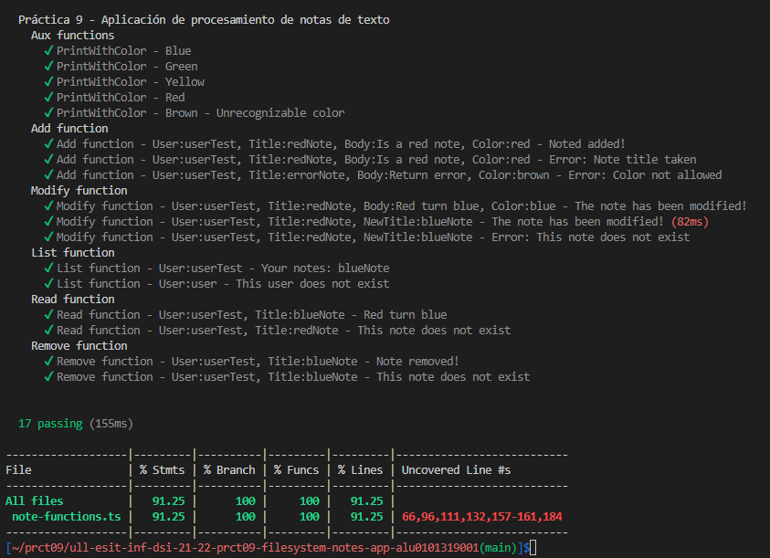
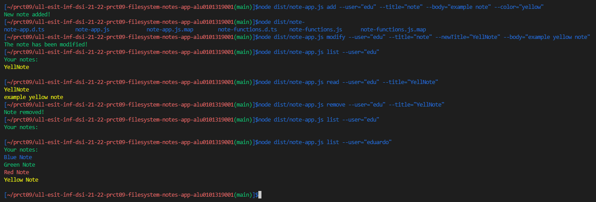
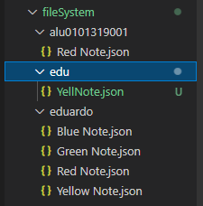

# Práctica 9 - Aplicación de procesamiento de notas de texto

[](https://github.com/ULL-ESIT-INF-DSI-2122/ull-esit-inf-dsi-21-22-prct09-filesystem-notes-app-alu0101319001/actions/workflows/node.js.yml)
[](https://coveralls.io/github/ULL-ESIT-INF-DSI-2122/ull-esit-inf-dsi-21-22-prct09-filesystem-notes-app-alu0101319001?branch=main)
[](https://sonarcloud.io/summary/new_code?id=ULL-ESIT-INF-DSI-2122_ull-esit-inf-dsi-21-22-prct09-filesystem-notes-app-alu0101319001)
## Contenidos 
- [Introducción a la práctica](#id0)
- [Comandos - note-app](#id1)
- [Funciones - note-functions](#id2)
- [Test - note-functions.spec](#id3)
- [Ejemplo de Uso](#id4)

## Introducción a la práctica<a name="id0"></a>
En esta práctica, se implementará una aplicación de procesamiento de texto. En concreto, la misma permitirá añadir, modificar, eliminar, listar y leer notas de un usuario concreto. Estas notas se almacenan en ficheros JSON, dentro del sistema de ficheros de la máquina que ejecute la aplicación. En concreto, se almacenará en un directorio conocido como: `./fileSystem/`. Por último, para interacturar con la aplicación se tendrá que usar la línea de comandos.

Por lo tanto, necesitaremos instalarnos varios paquetes para estos requisitos:
- __APIs__ proporcionadas por Node.js : `npm install --save-dev @types/node`
- __Chalk__ - Texto de colores: `npm install chalk@4.1.2`
- __Yargs__ - Linea de Comandos: `npm install yargs` && `npm install --save-dev @types/yargas`

De este modo, la estructura para solventar esta practica consiste en lo siguiente: 
- __Note-app__: programa principal, donde se gestionan los comandos, cada uno de ellos con sus opciones y manejadores correspondientes. Además, es el fichero que debemos ejecutar para procesar los argumentos pasados desde la línea de comandos. 
- __Note-functions__: almacena las funciones para la gestión de las notas, y que son ejecutadas en los manejadores de los comandos. 

Además, se lleva a cabo un fichero de pruebas, en las que son testeadas las funciones almacenadas en `./src/note-functions.ts`. Este test se ubica en `./tests/note-functions.spec.ts`. 

## Comandos - note-app<a name="id1"></a>
Usamos el paquete __Yargs__, anteriormente instalado, para parsear diferentes argumentos pasados a un programa desde la línea de comandos. Al final de este archivo, se ejecuta `yargs.parse()`, para poder procesar los argumentos pasados por línea de comandos a la aplicación. De esta forma, se gestionan los siguientes comandos: 

### Comando Add
Se crea el comando __add__, encargado de añadir una nueva nota. Se llamará de la forma `node dist/note-app.js add`. Como opciones se definen las siguientes, que todas serán obligatorias de definir: 
- __User name__: el usuario activo que está ejecutando el comando. Se llama como `--user="name"`. 
- __Note title__: el título de la nota y el que será el nombre del fichero JSON. Se llama como `--title="name"`. 
- __Note body__: el cuerpo de la nota, que se almacenará dentro del JSON. Se llama como `--body="text"`. 
- __Color__: define el color de la nota, que también se almacenará dentro del JSON. Se llama como `--color="color"`. 

De esta forma, el manejador, comprobará que se han introducido todas las opciones necesarias y ejecutará la función asociada, en este caso, `add()`. Esta función se detallará más adelante. Devolverá el mensaje que tendremos que mostrar por consola, y que nos indicará el feedback de ejecución de este comando. 

En este comando, es el momento en que también se crea un directorio con el nombre del usuario, en que se almacenarán todas sus notas (ficheros JSON). 

### Comando Modify
Se crea el comando __modify__, encargado de modificar una nota existente. Se llamará de la forma `node dist/note-app.js modify`. Como opciones se definen las siguientes, entre las cuáles, solo el usuario y el título serán obligatorias: 
- __User name__: el usuario activo que está ejecutando el comando. Se llama como `--user="name"`. 
- __Note title__: el título de la nota que se va a modificar. Se llama como `--title="name"`. 
- __New title__: el nuevo título de la nota, que se almacenará en el JSON y cambiará el nombre del fichero. Se llama como `--newTitle="name"`. 
- __Note body__: el nuevo cuerpo de la nota, que se almacenará dentro del JSON. Se llama como `--body="text"`. 
- __Color__: define el nuevo color de la nota, que también se almacenará dentro del JSON. Se llama como `--color="color"`. 

De esta forma, el manejador, comprobará que se han introducido todas las opciones necesarias y ejecutará la función asociada, en este caso, `modify()`. Esta función se detallará más adelante. Devolverá el mensaje que tendremos que mostrar por consola, y que nos indicará el feedback de ejecución de este comando. 

Las ultimas tres opciones de este comando son opcionales, por lo que se pueden ejecutar las tres a la vez, o solo uno de ellas, o cualquier de las combinaciones posibles. 

### Comando Remove
Se crea el comando __remove__, encargado de eliminar una nota existente. Se llamará de la forma `node dist/note-app.js remove`. Como opciones se definen las siguientes, todas de ellas obligatorias:  
- __User name__: el usuario activo que está ejecutando el comando. Se llama como `--user="name"`. 
- __Note title__: el título de la nota que se va a eliminar. Se llama como `--title="name"`. 

De esta forma, el manejador, comprobará que se han introducido todas las opciones necesarias y ejecutará la función asociada, en este caso, `remove()`. Esta función se detallará más adelante. Devolverá el mensaje que tendremos que mostrar por consola, y que nos indicará el feedback de ejecución de este comando. 

### Comando List
Se crea el comando __list__, encargado de listar todas las notas de un usuario. Se llamará de la forma `node dist/note-app.js list`. Como opciones, solo se define una obligatoria:  
- __User name__: el usuario activo que está ejecutando el comando, y del que imprimiremos todas sus notas, almacenadas en su directorio. Se llama como `--user="name"`. 

De esta forma, el manejador, comprobará que se han introducido todas las opciones necesarias y ejecutará la función asociada, en este caso, `list()`. Esta función se detallará más adelante. Devolverá el mensaje que tendremos que mostrar por consola, y que nos indicará el feedback de ejecución de este comando. 

### Comando Read
Se crea el comando __read__, encargado de leer una nota existente. Se llamará de la forma `node dist/note-app.js read`. Como opciones se definen las siguientes, todas de ellas obligatorias:  
- __User name__: el usuario activo que está ejecutando el comando. Se llama como `--user="name"`. 
- __Note title__: el título de la nota que se va a leer. Se llama como `--title="name"`. 

De esta forma, el manejador, comprobará que se han introducido todas las opciones necesarias y ejecutará la función asociada, en este caso, `read()`. Esta función se detallará más adelante. Devolverá el mensaje que tendremos que mostrar por consola, y que nos indicará el feedback de ejecución de este comando. 

## Funciones - note-functions<a name="id2"></a>
En este fichero, se definen todas las funciones que se ejecutan en los manejadores de los comandos correspondientes. Para ello, se trabaja con el sistema de ficheros desde TypeScript de manera síncrona. 

### Función Auxiliar - PrintWithColor
Esta función auxiliar está diseñada para imprimir un texto pasado por parámetro en el color que deseemos, también pasado como parámetro. En esta aplicación, solo son permitidos 4 colores: red, yellow, green y blue. En caso de introducir otro color, se devolverá un mensaje de error. 

```typescript
export function printWithColor(print: string, color: string): string {
  switch (color) {
    case 'red': {
      return chalk.red(print);
    }
    case 'yellow': {
      return chalk.yellow(print);
    }
    case 'blue': {
      return chalk.blue(print);
    }
    case 'green': {
      return chalk.green(print);
    }
    default: {
      return chalk.red('Error: Unrecognizable color');
    }
  }
}
```

### Función Add
Esta función será ejecutada desde el manejador del comando `add`. Por lo tanto, recibirá por parámetro los valores asignados a todas sus opciones, mencionadas anteriormente. 

El primer paso, consiste en comprobar si existe un directorio para el usuario introducido. En caso contrario, se creara uno nuevo. Tras ello, se comprobará que no existe una nota con el mismo titulo que introducimos y checkearemos que el color que deseamos para la nota existe en nuestra paleta, anteriormente mencionada. 

Si cumple estas condiciones, se instanciará un objeto, que será la base del nuevo JSON que deseamos crear, por lo que le pasremos los valores correspondientes y mediante el método `JSON.stringify()`, convertimos la información del objeto JSON a un string. Este string, será pasado al método `writeFileSync()`, que recibe la ruta del archivo JSON que vamos a crear y el contenido del mismo, es decir, el string que se ha mencionado. Si no se detecta ningún error, se devolverá un mensaje en verde confirmando el éxito de la operación. 

En caso de que se produzca cualquiera de los fallos posibles, se devolverá un mensaje en rojo, indicando dicho error. 

```typescript
export function add(userParam: string, titleParam: string, bodyParam: string, colorParam: string): string {
  if (!fs.existsSync(`./fileSystem/${userParam}`)) {
    fs.mkdirSync(`./fileSystem/${userParam}/`, {recursive: true});
  }

  const obj = {
    title: 'empty',
    body: 'empty',
    color: 'empty',
  };

  let out:string = '';

  if ((!fs.existsSync(`./fileSystem/${userParam}/${titleParam}.json`))) {
    if (colorRegister.includes(colorParam)) {
      obj.title = titleParam;
      obj.body = bodyParam;
      obj.color = colorParam;
      const addJson = JSON.stringify(obj);
      try {
        fs.writeFileSync(`./fileSystem/${userParam}/${titleParam}.json`, addJson);
        out = chalk.green('New note added!');
      } catch (err) {
        out = chalk.red('Error: Something went wrong when writing note');
      }
    } else {
      out = chalk.red('Error: Color not allowed');
    }
  } else {
    out = chalk.red('Error: Note title taken!');
  }
  return out;
}
```

### Función Modify
Esta función será ejecutada desde el manejador del comando `modify`. Por lo tanto, recibirá por parámetro los valores asignados a todas sus opciones, mencionadas anteriormente. Esta función acepta parámetros opcionales, de la forma que ya mencionamos en los comandos. 

Lo primero que se hará es comprobar que ya existe el fichero JSON con la nota que deseamos modificar. De esta forma, mediante el método `fs.readFileSync()`, obtendremos la información actual del JSON que debemos modificar. Por lo que, por cada parámetro opcional introducido, modificaremos el objeto JSON original con los nuevos datos. En el caso del nuevo título, se llamára al método `fs.renameSync()`, para cambiarle el nombre del fichero JSON con el núevo título. 

Con el nuevo objeto listo, haremos los mismos pasos que en la función anterior para escribir el fichero con la nueva información. 

```typescript
export function modify(userParam: string, titleParam: string, newTitle?: string, bodyParam?: string, colorParam?: string): string {
  let out: string;
  if ((fs.existsSync(`./fileSystem/${userParam}/${titleParam}.json`))) {
    const data = fs.readFileSync(`./fileSystem/${userParam}/${titleParam}.json`, 'utf8');
    const value = JSON.parse(data.toString());
    if (newTitle !== undefined) {
      value.title = newTitle;
      try {
        fs.renameSync(`./fileSystem/${userParam}/${titleParam}.json`, `./fileSystem/${userParam}/${value.title}.json`);
      } catch (err) {
        out = chalk.red('Error: Something went wrong when rename note file');
      }
    }
    if (bodyParam !== undefined) {
      value.body = bodyParam;
    }
    if (colorParam !== undefined) {
      value.color = colorParam;
    }
    const addJson = JSON.stringify(value);

    try {
      fs.writeFileSync(`./fileSystem/${userParam}/${value.title}.json`, addJson);
      out = chalk.green('The note has been modified!');
    } catch (err) {
      out = chalk.red('Error: Something went wrong when writing note');
    }
  } else {
    out = chalk.red('Error: This note does not exist');
  }
  return out;
}
```

### Función Remove
Esta función será ejecutada desde el manejador del comando `remove`. Por lo tanto, recibirá por parámetro los valores asignados a todas sus opciones, mencionadas anteriormente. 

Lo primero que hará es comprobar la existencia del fichero JSON que deseamos eliminar. En caso afirmativo, se ejecutará el método `fs.unlinkSync()`, al que se le pasa la ruta de dicho fichero y lo elimina. 

```typescript
export function remove(userParam: string, titleParam: string): string {
  let out: string;
  if ((fs.existsSync(`./fileSystem/${userParam}/${titleParam}.json`))) {
    try {
      fs.unlinkSync(`./fileSystem/${userParam}/${titleParam}.json`);
      out = chalk.green('Note removed!');
    } catch (err) {
      out = chalk.red('Error: Something went wrong when remove note');
    }
  } else {
    out = chalk.red('Error: This note does not exist');
  }
  return out;
}
```

### Función List
Esta función será ejecutada desde el manejador del comando `list`. Por lo tanto, recibirá por parámetro los valores asignados a todas sus opciones, mencionadas anteriormente. 

Se comprueba que el usuario tiene un directorio que leer. En caso afirmativo, mediante el método `fs.readdirSync()`, se obtiene cada uno de los ficheros que este contiene, que para cada uno lo leeremos con `fs.readFileSync()`, para obtener el valor del atributo __color__ y de esta forma imprimir el nombre de dicho fichero con el color correspondiente.

```typescript
export function list(userParam: string): string {
  let out: string;
  if ((fs.existsSync(`./fileSystem/${userParam}/`))) {
    out = chalk.green('Your notes:\n');
    try {
      const files = fs.readdirSync(`./fileSystem/${userParam}/`);
      files.forEach((file) => {
        try {
          const data = fs.readFileSync(`./fileSystem/${userParam}/${file}`);
          const value = JSON.parse(data.toString());
          out += printWithColor(value.title, value.color) + '\n';
        } catch (err) {
          out = chalk.red('Error: Something went wrong when read note');
        }
      });
    } catch (err) {
      out = chalk.red('Error: Something went wrong when list note');
    }
  } else {
    out = chalk.red('Error: This user does not exist');
  }
  return out;
}
```

### Función Read
Esta función será ejecutada desde el manejador del comando `read`. Por lo tanto, recibirá por parámetro los valores asignados a todas sus opciones, mencionadas anteriormente. 

Se comprueba que existe el fichero JSON que deseamos leer y se procede a la obtensión de sus datos mediante el método `fs.readFileSync()`. 

```typescript
export function read(userParam: string, titleParam: string): string {
  let out: string;
  if ((fs.existsSync(`./fileSystem/${userParam}/${titleParam}.json`))) {
    try {
      const data = fs.readFileSync(`./fileSystem/${userParam}/${titleParam}.json`);
      const value = JSON.parse(data.toString());
      out = printWithColor(value.title, value.color) + '\n';
      out += printWithColor(value.body, value.color);
    } catch (err) {
      out = chalk.red('Error: Something went wrong when read note');
    }
  } else {
    out = chalk.red('Error: This note does not exist');
  }
  return out;
}
```

## Test - note-functions.spec<a name="id3"></a>
Se elaboraron los tests suficientes para comprobar todas las salidas de las funciones previamente vistas. Se queda sin poder comprobar los mensajes de fallo en los métodos `fs`. En algunos métodos en donde se modifican los ficheros JSON, se realizan comprobaciones extras en estos ficheros para asegurar que las funciones han accedido correctamente a estos ficheros y escritos en ellos de la forma deseada. 

```typescript
context('Práctica 9 - Aplicación de procesamiento de notas de texto', () => {
  describe('Aux functions', () => {
    it('PrintWithColor - Blue', () => {
      expect(printWithColor('print', 'blue')).to.be.eql(chalk.blue('print'));
    });
    it('PrintWithColor - Green', () => {
      expect(printWithColor('print', 'green')).to.be.eql(chalk.green('print'));
    });
    it('PrintWithColor - Yellow', () => {
      expect(printWithColor('print', 'yellow')).to.be.eql(chalk.yellow('print'));
    });
    it('PrintWithColor - Red', () => {
      expect(printWithColor('print', 'red')).to.be.eql(chalk.red('print'));
    });
    it('PrintWithColor - Brown - Unrecognizable color', () => {
      expect(printWithColor('print', 'brown')).to.be.eql(chalk.red('Error: Unrecognizable color'));
    });
  });

  describe('Add function', () => {
    it('Add function - User:userTest, Title:redNote, Body:Is a red note, Color:red - Noted added!', () => {
      expect(add('userTest', 'redNote', 'Is a red note', 'red')).to.be.eql(chalk.green('New note added!'));
      const data = fs.readFileSync(`./fileSystem/userTest/redNote.json`, 'utf8');
      const value = JSON.parse(data.toString());
      expect(value.title).to.be.eql('redNote');
      expect(value.body).to.be.eql('Is a red note');
      expect(value.color).to.be.eql('red');
    });
    it('Add function - User:userTest, Title:redNote, Body:Is a red note, Color:red - Error: Note title taken', () => {
      expect(add('userTest', 'redNote', 'Is a red note', 'red')).to.be.eql(chalk.red('Error: Note title taken!'));
    });
    it('Add function - User:userTest, Title:errorNote, Body:Return error, Color:brown - Error: Color not allowed', () => {
      expect(add('userTest', 'errorNote', 'Return error', 'brown')).to.be.eql(chalk.red('Error: Color not allowed'));
    });
  });

  describe('Modify function', () => {
    it('Modify function - User:userTest, Title:redNote, Body:Red turn blue, Color:blue - The note has been modified!', () => {
      expect(modify('userTest', 'redNote', undefined, 'Red turn blue', 'blue')).to.be.eql(chalk.green('The note has been modified!'));
      const data = fs.readFileSync(`./fileSystem/userTest/redNote.json`, 'utf8');
      const value = JSON.parse(data.toString());
      expect(value.title).to.be.eql('redNote');
      expect(value.body).to.be.eql('Red turn blue');
      expect(value.color).to.be.eql('blue');
    });
    it('Modify function - User:userTest, Title:redNote, NewTitle:blueNote - The note has been modified!', () => {
      expect(modify('userTest', 'redNote', 'blueNote', undefined, undefined)).to.be.eql(chalk.green('The note has been modified!'));
      const data = fs.readFileSync(`./fileSystem/userTest/blueNote.json`, 'utf8');
      const value = JSON.parse(data.toString());
      expect(value.title).to.be.eql('blueNote');
      expect(value.body).to.be.eql('Red turn blue');
      expect(value.color).to.be.eql('blue');
    });
    it('Modify function - User:userTest, Title:redNote, NewTitle:blueNote - Error: This note does not exist', () => {
      expect(modify('userTest', 'redNote', 'blueNote', undefined, undefined)).to.be.eql(chalk.red('Error: This note does not exist'));
    });
  });

  describe('List function', () => {
    it('List function - User:userTest - Your notes: blueNote', () => {
      let out: string = chalk.green('Your notes:\n');
      out += chalk.blue('blueNote') + '\n';
      expect(list('userTest')).to.be.eql(out);
    });
    it('List function - User:user - This user does not exist', () => {
      expect(list('user')).to.be.eql(chalk.red('Error: This user does not exist'));
    });
  });

  describe('Read function', () => {
    it('Read function - User:userTest, Title:blueNote - Red turn blue', () => {
      let out = chalk.blue('blueNote') + '\n';
      out += chalk.blue('Red turn blue');
      expect(read('userTest', 'blueNote')).to.be.eql(out);
    });
    it('Read function - User:userTest, Title:redNote - This note does not exist', () => {
      expect(read('userTest', 'readNote')).to.be.eql(chalk.red('Error: This note does not exist'));
    });
  });

  describe('Remove function', () => {
    it('Remove function - User:userTest, Title:blueNote - Note removed!', () => {
      expect(remove('userTest', 'blueNote')).to.be.eql(chalk.green('Note removed!'));
    });
    it('Remove function - User:userTest, Title:blueNote - This note does not exist', () => {
      expect(remove('userTest', 'blueNote')).to.be.eql(chalk.red('Error: This note does not exist'));
      fs.rmdirSync('./fileSystem/userTest');
    });
  });
});
```

Los __resultados__ de estos tests, son los siguientes: 


## Ejemplo de Uso<a name="id4"></a>
En la siguiente captura se muestra un ejemplo de uso de los comandos y funciones ya comentadas. 



Además, en la siguiente captura, se puede ver un ejemplo de como se almacenan los JSON: 




