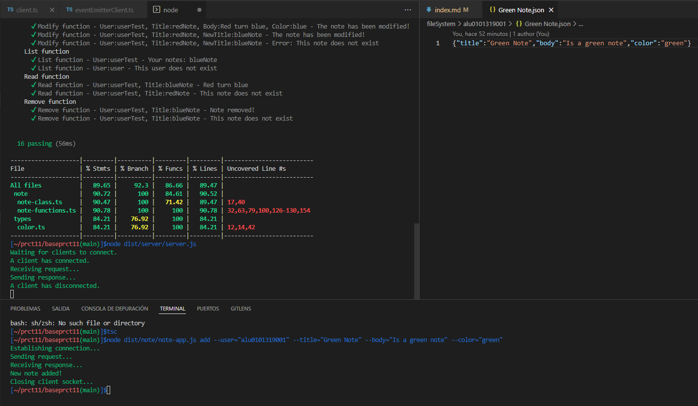

# Práctica 11 - Cliente y servidor para una aplicación de procesamiento de notas de texto

## Contenidos 
- [Introducción a la práctica](#id0)
- [Tipos](#id1)
- [Note-Class & Note-App](#id2)
- [Server](#id3)
- [Client](#id4)
- [Funcionamiento](#id5)
## Introducción a la práctica<a name="id0"></a>
En esta práctica, se partía de la base elaborado en la [Práctica 9](https://github.com/ULL-ESIT-INF-DSI-2122/ull-esit-inf-dsi-21-22-prct09-filesystem-notes-app-alu0101319001.git). Con esta aplicación de procesamiento de notas de texto, ahora implementaremos un servidor y un cliente, haciendo uso de los sockets proporcionados por el módulo `net` de Node.js. 

Las operaciones que podrá solicitar el cliente al servidor serán las mismas que las de la la Práctica 9, esto es, __añadir, modificar, eliminar, listar y leer notas de un usuario concreto__. Un usuario interactuará con el cliente de la aplicación, exclusivamente, a través de la __línea de comandos__. Al mismo tiempo, en el servidor, las notas se almacenarán como ficheros JSON en el sistema de ficheros y siguiendo la misma estructura de directorios utilizada durante la Práctica 9.

El código fuente se divide en cuatro directorios: 
- __Client__ : alberga los ficheros `client.ts` y `eventEmitterClient.ts`. En client, se declara la clase __Client__, que será utilizada desde el fichero principal de la aplicación de notas; mientras que la clase __MessageEventEmitterClient__, es usada por la clase cliente para emitir los eventos correspondientes.
- __Server__ : alberga los fichero `server.ts` y `eventEmitterServer.ts`. Sigue el mismo funcionamiento y estructura que el cliente.
- __Note__ : alberga los ficheros de la _Práctica 9_, más uno añadido, `note-class.ts`, en que se define la estructura de una nota. 
- __Types__ : alberga las definiciones y funciones auxiliares de tipos usados en los ficheros anteriores. 

## Tipos<a name="id1"></a>
Como se ha mencionado anteriormente, en el directorio `/src/types/`, se definen los tipos usados en los ficheros principales de la práctica. Entre ellos tenemos: 

- __Color__ : define el tipo `Color`, que alberga los 4 colores que se manejan en la práctica, más un posible valor _undefined_. Aparte, se implementan dos funciones auxiliares, en las que se proveen facilitadores para trabajar con este tipo. En la función `translateColor(string): Color`, traducimos un string, que contiene el nombre de un color, a un tipo de datos Color. Mientras que en `printWithColor(string, Color): string`, hacemos uso de la librería `chalk` para poder imprimir distintos mensajes con el color deseado. 

- __Commands__ : define el tipo `Command`. Este tipo alberga los distintos comandos empleados en nuestra aplicación (vistos anteriormente en la _Práctica 9_). Además, incorpora una función auxiliar para traducir el tipo de dato _string_, que contiene el nombre de un comando, en el tipo de dato _Command_. 

- __Request__ : define el tipo `RequestType`. Este tipo, define el mensaje de request que enviará el cliente al servidor. Por lo que se definen los dos atributos obligatorios que debe contenter : el comando a usar y el usuario que lo ejecuta; y se añaden el resto de atributos opcionales que puede tener un mensaje de este tipo (título, nuevo título, cuerpo y color). 

```typescript 
import {Color} from "./color";
import {Command} from "./commands";

export type RequestType = {
  type: Command;
  user: string;
  title?: string;
  newTittle?: string;
  body?: string;
  color?: Color;
}
```
## Note-Class & Note-App<a name="id2"></a>
Se define la clase `Note`. Con ella, se intenta dar identidad a la estructura de datos que utilizamos para definir una nota. Incluyendo sus atributos necesarios, ya mencionados, y sus formas en JSON, ya sea en versión _string_ o en versión _objeto_. De esta forma, podremos manipular una nota como una estructura de datos propia. 

```typescript
/* eslint-disable max-len */
import {Color} from '../types/color';

export class Note {
  private noteString: string;
  private noteJSON;
  constructor(public title: string, public body: string, public color: Color) {
    this.noteString = JSON.stringify({title: this.title, body: this.body, color: this.color});
    this.noteJSON = JSON.parse(this.noteString);
  }

  getNoteString(): string {
    return this.noteString;
  }

  getNoteJSON() {
    return this.noteJSON;
  }

  setValues(title?: string, body?: string, color?: Color): void {
    if (title != undefined) {
      this.title = title;
    }
    if (body != undefined) {
      this.body = body;
    }
    if (color != undefined) {
      this.color = color;
    }
    this.updatePrivatesValues();
    return;
  }

  setWithString(JSONstring : string) {
    const json = JSON.parse(JSONstring);
    this.setValues(json.title, json.body, json.color);
  }

  setWithJSON(json : any) {
    this.setValues(json.title, json.body, json.color);
  }

  private updatePrivatesValues(): void {
    this.noteString = JSON.stringify({title: this.title, body: this.body, color: this.color});
    this.noteJSON = JSON.parse(this.noteString);
  }
}
```

Por otro lado, se ha modificado los __handler__ de los comandos en el fichero `/src/note/note-app.ts`. De esta forma, ahora se construye un objeto __RequestType__, que se le pasa a un cliente, que pedirá al servidor que resuelva su petición. 

```typescript
  handler(argv) {
    if ((typeof argv.title === 'string') && (typeof argv.user === 'string') &&
    (typeof argv.body === 'string') && (typeof argv.color === 'string')) {
      const command: Command = 'add';
      const color: Color = translateColor(argv.color);
      const input : RequestType = {
        type: command,
        user: argv.user,
        title: argv.title,
        newTittle: undefined,
        body: argv.body,
        color: color,
      };
      const client = new Client(60300, input);
      client.active();
    }
  },
```

## Server<a name="id3"></a>
Para implementar el servidor, se crea la clase `Server`. En ella, le pasamos el puerto que vamos a abrir en el constructor. Luego, definimos una función `active()`, en que se realiza la creación del socket con el puerto definido. 

En la conección, instanciamos un objeto __server__, propiedad de la clase `MessageEventEmitterServer`. En esta clase, le pasamos un socket en el constructor y con él, espera a la llega de datos para obtener todos los mensajes y emitir un evento __request__, enviando también los datos recibidos con los que se desea realizar esta petición. 

De esta forma, de vuelta a la clase `Server`, se escucharán los eventos __request__ para poder tratarlos de forma adecuada y dar respuesta a la petición. Para ello, se ha definido la función `handlerRequest(message)`, que recibe el objeto JSON enviado junto a la petición y lo analiza, de forma que distingue que tipo de comando se quiere ejecutar y llama a las funciones del fichero `/src/note/note-functions.ts`, introduciendoles los parámetros necesarios, obtenidos también del objeto __message__. De esta forma, devuelve un _string_, que será el mensaje respuesta de la función. 

Con este mensaje, se envía la respuesta al cliente, como un JSON básico. Al final de la clase, se instancia un objeto del mismo y se llama a la función __active()__, con la intención de que para abrir el servidor se tenga que ejecutar este fichero en la consola. 

```typescript
/* eslint-disable max-len */
import * as net from 'net';
import chalk from 'chalk';
import {MessageEventEmitterServer} from './eventEmitterServer';
import * as ntFunc from '../note/note-functions';

export class Server {
  constructor(private port: number) {}

  active() {
    net.createServer((connection) => {
      console.log(chalk.green('A client has connected.'));

      connection.on('close', () => {
        console.log(chalk.green('A client has disconnected.'));
      });

      const server = new MessageEventEmitterServer(connection);

      server.on('request', (message) => {
        console.log(chalk.green('Receiving request...'));
        const response = this.handlerRequest(message);
        const json = {type: 'response', response: response};
        connection.write(JSON.stringify(json) + '\n', (err) => {
          if (err) {
            console.log(chalk.red('Error sending response'));
          } else {
            console.log(chalk.green('Sending response...'));
          }
        });
      });
    }).listen(this.port, () => {
      console.log(chalk.green('Waiting for clients to connect.'));
    });
  }

  private handlerRequest(message: any): string {
    let response: string = '';
    if (message.type == 'add') {
      response = ntFunc.add(message.user, message.title, message.body, message.color);
    } else if (message.type = 'modify') {
      response = ntFunc.modify(message.user, message.title, message.newTitle, message.body, message.color);
    } else if (message.type = 'remove') {
      response = ntFunc.remove(message.user, message.title);
    } else if (message.type = 'read') {
      response = ntFunc.read(message.user, message.title);
    } else if (message.type = 'list') {
      response = ntFunc.list(message.user);
    } else if (message.type = undefined) {
      response = chalk.red('Error: Undefined command');
    }
    return response;
  }
}

const server = new Server(60300);
server.active();
```

## Client<a name="id4"></a>
Para implementar al cliente, se crea la clase `Client`. En el constructor, se recibe el puerto al que deseamos conectarnos y el input de tipo __RequestType__, que contendrá toda la información necesaria para poder realizar la petición. 

Además, se define la función __active()__, a la que se llamará desde el fichero `src/note/note-app.ts`, para comenzar la solicitud de la petición. Para ello, se instancia un objeto de la clase `MessageEventEmitterClient`, encargada de connectarse al puerto, emitir el evento __request__ y esperar la llegada de la respuesta, emitiendo entonces el evento __response__. 

De vuelta en la clase `Server`, esperamos dos tipos de eventos: un evento `request`, que indicará que se debe enviar al servidor los datos del atributo _input_, realizando la petición que deseamos. Y por otro lado, un evento `response`, obteniendo la respuesta del servidor y mostrándola por la consola del cliente. Una vez obtenida la resputa, se cerrará el socket del cliente, lo que llamará al evento `close`, que indicará el cierre del mismo. 

```typescript
/* eslint-disable max-len */
import * as net from 'net';
import chalk from 'chalk';
import {RequestType} from '../types/request';
import {MessageEventEmitterClient} from './eventEmitterClient';

export class Client {
  private clientSocket: net.Socket;
  constructor(private port: number, private input: RequestType) {
    this.clientSocket = new net.Socket();
  }

  active() {
    const clientEvent = new MessageEventEmitterClient(this.clientSocket, this.port);

    clientEvent.on('request', () => {
      console.log(chalk.green('Establishing connection...'));
      this.clientSocket.write(JSON.stringify(this.input) + '\n', (err) => {
        if (err) {
          console.error(chalk.red('Error on sending request'));
        } else {
          console.log(chalk.green('Sending request...'));
        }
      });
    });

    clientEvent.on('response', (message) => {
      console.log(chalk.green('Receiving response...'));
      console.log(message.response);
      this.clientSocket.end();
    });

    this.clientSocket.on('close', (err) => {
      if (err) {
        console.log(chalk.red('Error: In closing client socket'));
      } else {
        console.log(chalk.green('Closing client socket...'));
      }
    });
  }
}
```

## Funcionamiento<a name="id5"></a>
A continuación, se muestra una captura con un ejemplo de funcionamiento del programa: 



